<div align="center">


# NIRANTHARA

### The AI Mental Health Continuity Platform

**A psychiatrist sees a patient one hour a month. Niranthara makes the other 729 hours visible.**

Passive monitoring · Just-in-time interventions · Real-time clinician risk intelligence
*ML-first — zero hardcoding — zero keyword matching*

[](https://reactnative.dev)
[](https://react.dev)
[](https://nodejs.org)
[](https://fastapi.tiangolo.com)
[](https://firebase.google.com)
[](https://pytorch.org)
[](https://xgboost.readthedocs.io)
[](https://huggingface.co)
[](https://build.nvidia.com)
[](https://health.google/health-connect-android/)

</div>

---

## 1. Problem Statement

> *How might we utilize AI chatbots and machine learning to address incomplete alleviation of depression symptoms, attrition, and loss of follow-up in mental health treatment?*

Depression treatment fails in the **gaps between appointments**, not in the appointments:

| Failure mode | Reality |
|---|---|
| Incomplete symptom alleviation | 50–70% of patients on first-line antidepressants do not reach remission; residual symptoms are the strongest relapse predictor |
| Attrition | 20–60% of outpatients drop out of therapy — silently, between sessions |
| Loss of follow-up | A clinician observes ~1 of every 730 hours of a patient's month |
| Relapse | 50% after one episode, 80%+ after two; prodromal signals (sleep, activity, language) appear days before subjective awareness |

## 2. Solution Overview

Niranthara is a **closed loop**, not a chatbot:

```
passive detection → ML risk prediction → just-in-time intervention → clinician escalation → follow-up recapture
```

Every stage is a trained model. A smartwatch and phone sense continuously; nine ML systems score risk per-patient; interventions arrive when a per-user receptivity model says the patient will accept them; clinicians receive triaged, SHAP-explained alerts in real time; and a background sweep guarantees nobody silently exits care — which is the problem statement, answered by architecture.

## 3. Key Features

| # | Feature | Powered by | Surface |
|---|---|---|---|
| 1 | AI companion chat, multi-turn memory, context-injected (mood, cycle, risk, emotion) | Llama 3.1 8B → Minimax M2.7 chain, NVIDIA cloud | Mobile |
| 2 | Crisis detection on every journal and chat message | `sentinet/suicidality` | Mobile → Dashboard |
| 3 | Two-tier medication guardrail (input question deferral + output dosing block) | Deterministic safety floor | Mobile |
| 4 | In-app crisis support: tap-to-call Tele-MANAS 14416, grounding, breathing — offline-capable | — | Mobile |
| 5 | PHQ-9 and GAD-7 validated assessments, one question per screen, server-scored | Item-9 self-harm protocol → clinician alert | Mobile → Dashboard |
| 6 | Journal → 15-feature risk fusion with SHAP explainability | XGBoost + SHAP | Mobile → Dashboard |
| 7 | Mood–language divergence (masked-depression signal) | IndicBERT sentiment vs stated mood | Both |
| 8 | Device-agnostic wearable biometrics (Fitbit, Samsung, Pixel, any Health Connect writer) | `react-native-health-connect` | Mobile |
| 9 | Multi-signal physiological stress score with partial-data rules and ≥2-signal alert corroboration | Personal-baseline deviations | Backend |
| 10 | Menstrual-cycle vulnerability forecasting | Per-user PyTorch LSTM | Mobile → Dashboard |
| 11 | Behavioral anomaly detection | Per-user LSTM autoencoder | AI service |
| 12 | Attrition / dropout prediction | XGBoost disengagement classifier | Backend cron |
| 13 | JITAI — interventions timed by per-user receptivity models (hourly sweep) | Per-user XGBoost | Backend cron |
| 14 | Loss-of-follow-up escalation (15-minute sweep, 6h dedup) | Cron + risk state | Backend → Dashboard |
| 15 | Real-time clinician dashboard: triaged caseload, live alerts (<1s), browser notifications | Firestore `onSnapshot` | Dashboard |
| 16 | AI clinical summary: 30 days → 5 clinical sentences from structured signals only | Minimax M2.7 → Llama chain | Dashboard |
| 17 | Field-level AES-256-GCM encryption of journals and chat before the database | `backend/utils/encryption.js` | Backend |
| 18 | Offline-first mobile with sync queue | AsyncStorage + NetInfo | Mobile |
| 19 | Tamil/Tanglish understanding; replies always Latin-script (English or Tanglish) | IndicBERT + language detector | Mobile |
| 20 | PDF patient report export, manual flagging, alert resolve workflow | jsPDF | Dashboard |

## 4. Overall Architecture

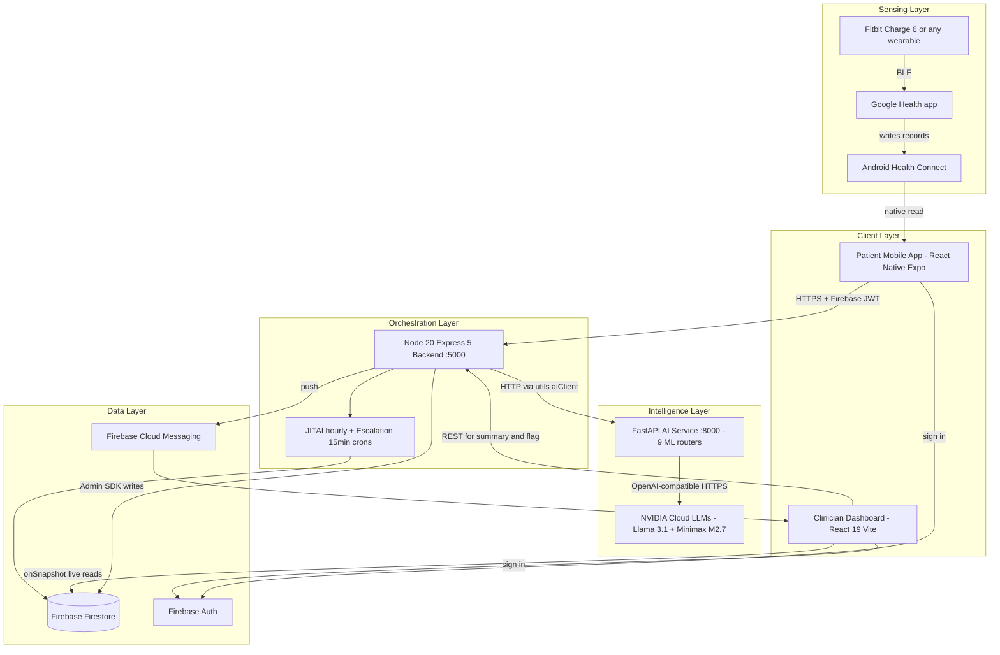

**Why this shape:** the backend is a thin orchestration layer (auth, encryption, Firestore writes, crons) that proxies all intelligence to the AI service through a single boundary module; Firestore is the integration bus that gives the dashboard sub-second reactivity with zero polling; and the wearable path reads Health Connect — not any vendor API — so every watch brand is one adapter, not one integration.

## 5. System Architecture

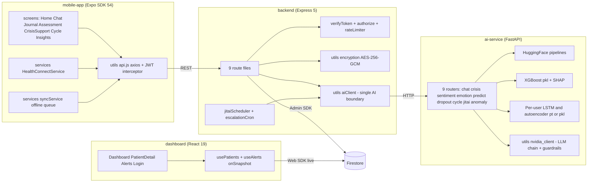

## 6. Technology Stack — Complete Breakdown

### AI / ML (ai-service, Python 3.11)

| Technology | Version | Category | Purpose in Project | Why Chosen | Key Features Used |
|---|---|---|---|---|---|
| FastAPI | 0.110.0 | ML serving framework | 9 routers exposing every model as REST | Async-native, Pydantic validation, auto OpenAPI docs at `/docs` | Routers, Pydantic v2 models, startup events (model warm-up) |
| PyTorch | ≥2.6.0 | Deep learning | Per-user cycle LSTMs and LSTM autoencoders (behavioral anomaly manifold) | Dynamic graphs suit per-user model training at runtime | `nn.LSTM`, state dicts persisted per uid, CPU inference |
| transformers | ≥4.45.0 | NLP models | Crisis (`sentinet/suicidality`), emotion (`distilroberta`), sentiment (IndicBERT) pipelines | Pretrained clinical/multilingual checkpoints, zero training required | `pipeline()`, `AutoTokenizer`, lazy load + boot warm-up |
| XGBoost | ≥2.1.0 | Gradient boosting | 15-feature risk fusion, dropout classifier, per-user JITAI receptivity | Tabular SOTA, fast CPU inference, SHAP-compatible | `predict_proba`, multiclass softprob, pkl persistence |
| SHAP | ≥0.50.0 | Explainability | Top-3 risk drivers on every prediction, dashboard + mobile panels | Model-honest attributions clinicians can defend | `TreeExplainer`, version-normalized via `_select_class_shap()` |
| openai (SDK) | ≥1.12.0 | LLM client | NVIDIA's OpenAI-compatible endpoint (`integrate.api.nvidia.com`) | One SDK, any provider; `max_retries=0` because the model chain is the retry strategy | `AsyncOpenAI`, per-request `timeout`, chat completions |
| scikit-learn | ≥1.6.0 | ML utilities | Train/test splits, metrics, scalers for trainers | Standard tooling | `train_test_split`, `StandardScaler`, CV metrics |
| pandas / numpy | ≥2.2.3 / ≥2.1.0 | Data | Feature engineering, synthetic training data | Ubiquitous | DataFrames, vectorized ops |
| sentencepiece / protobuf | ≥0.2.0 / ≥4.25.0 | Tokenization | IndicBERT (ALBERT) tokenizer backend | Required by the checkpoint | — |
| uvicorn | 0.27.0 | ASGI server | Serves FastAPI | Standard | `--port 8000` |
| python-dotenv | 1.0.0 | Config | Loads `NVIDIA_API_KEY` **before router imports** (import-time read) | 12-factor | `load_dotenv()` at top of `main.py` |
| httpx / psutil | 0.26.0 / ≥5.9.8 | HTTP client / system | Sarvam STT calls; system stats | — | — |

### Backend (Node 20)

| Technology | Version | Category | Purpose | Why Chosen | Key Features Used |
|---|---|---|---|---|---|
| Express | ^5.2.1 | Web framework | 9 route modules, middleware pipeline | Minimal, middleware ecosystem | Router, JSON body 10mb, error middleware |
| firebase-admin | ^13.8.0 | Auth + DB | `verifyIdToken` on every protected route; all Firestore writes; FCM push | Server-side trust boundary for Firebase | Auth verify, Firestore Admin SDK, Messaging |
| axios | ^1.15.0 | HTTP client | All AI-service calls via `utils/aiClient.js` (single instance: base URL, 15s default, LLM paths 45s) | Interceptors, per-request config | `axios.create`, timeouts |
| node-cron | ^4.2.1 | Scheduling | JITAI hourly sweep; escalation every 15 min | In-process, demo-simple (queue is the V2 path) | `cron.schedule` |
| helmet | ^8.1.0 | Security | HTTP security headers | OWASP hardening in one line | Defaults |
| express-rate-limit | ^8.3.2 | Security | Per-route limits (`chatLimiter`, `nlpLimiter`, `generalLimiter`) | Abuse protection at the edge | Window + max per route class |
| cors / dotenv | ^2.8.6 / ^17.4.2 | Middleware / config | Cross-origin for dashboard; env loading + fail-fast validation | — | — |
| Node `crypto` | built-in | Encryption | AES-256-GCM field-level encryption of journals, chat, before Firestore | No dependency, authenticated encryption | `createCipheriv('aes-256-gcm')`, IV + auth tag per field |

### Mobile (React Native)

| Technology | Version | Category | Purpose | Why Chosen | Key Features Used |
|---|---|---|---|---|---|
| Expo | ~54 | RN platform | Build/dev tooling, dev-client for native modules | Fastest RN iteration; EAS builds | `expo start --dev-client`, expo-font, expo-notifications |
| React Native | 0.81.5 | UI framework | All patient screens | — | Hooks, `StyleSheet.create` co-located styles, Animated |
| react-native-health-connect | ^3.5.3 | Wearables | Reads HR, steps, sleep, HRV, calories, distance from Android Health Connect | **The device-agnostic decision**: every vendor writes into Health Connect; one adapter covers all watches | `initialize`, `requestPermission`, `readRecords` with time-range filters, dataOrigin → provider names |
| firebase (Web SDK) | ^12.12.1 | Auth | Sign-in; ID token minted per request via axios interceptor | — | `getIdToken()` |
| @react-native-async-storage | 2.2.0 | Storage | Offline-first queue + secure local state | — | Offline mood-log queue |
| @react-native-community/netinfo | 11.4.1 | Network | Online/offline detection for the sync wrapper | — | `NetInfo.fetch()` |
| react-navigation (native, stack, tabs) | ^7.x | Navigation | Tab bar (Home/Journal/Care/Cycle) + stack (Assessment, CrisisSupport, interventions) | — | Nested navigators, fade transition for crisis screen |
| react-native-svg | 15.12.1 | Graphics | Risk ring, cycle ring, HRV arc | Crisp vector gauges | `Circle`, `Path`, `SvgText`, animated dash |
| @expo-google-fonts (Cormorant Garamond, DM Sans) | ^0.4.x | Typography | Style-guide fonts | Build_Guide §40 | `useFonts` load at boot |
| expo-notifications / expo-task-manager / expo-background-fetch | ~0.32 / ~14 / ~14 | Background | Local notifications; passive monitor registration | — | Background task registry |

### Dashboard (Web)

| Technology | Version | Category | Purpose | Why Chosen | Key Features Used |
|---|---|---|---|---|---|
| React | ^19.2.5 | UI | Clinician pages | — | Hooks, functional components |
| Vite | ^8.0.9 | Build | Dev server + production build | Fast HMR | `import.meta.env.VITE_*` |
| firebase (Web SDK) | ^12.12.0 | Data + auth | **`onSnapshot` live reads are the real-time architecture** — no REST polling for caseload/alerts | Sub-second alert delivery on stage and in clinic | `onSnapshot`, `query(where(...))`, client-side filter/sort (composite-index avoidance) |
| recharts | ^3.8.1 | Charts | 30-day risk trajectory, assessments trajectory | Declarative, composable | `AreaChart`, `LineChart`, gradients |
| jspdf | ^4.2.1 | Export | Patient PDF report | Client-side, no server render | `splitTextToSize` |
| react-router-dom | ^7.14.1 | Routing | `/dashboard`, `/patient/:uid`, `/alerts` | — | `useParams`, `useNavigate` |
| Notification API | browser | Alerts | OS notification per new unresolved alert, background-tab capable | Zero-dependency clinician reach | `tag` dedup, `requireInteraction` for crisis |

### LLM Chain (cloud)

| Model | Role | Budget | Why |
|---|---|---|---|
| `meta/llama-3.1-8b-instruct` | **Chat primary** (`NVIDIA_CHAT_MODEL`) | 12s (`NVIDIA_CHAT_TIMEOUT`) | ~1–2s measured replies — conversation is latency-first |
| `minimaxai/minimax-m2.7` | **Summary primary** + chat quality backstop (`NVIDIA_MODEL`) | 25s (`NVIDIA_PRIMARY_TIMEOUT`) | Reasoning model; best clinical-register writing; 20–60s latency acceptable behind a button, not in chat |
| Rotating static fallbacks | Last resort, explicitly labeled `fallback_*` | — | The patient is never left unanswered |

Guardrails (deterministic, labeled safety floor — not clinical decisions): `is_dosing_question()` defers medication-dose questions **before** the LLM runs (language-proof); `apply_output_guardrail()` blocks dosing advice in replies. Client created with `max_retries=0` — the chain is the retry strategy (SDK retries multiplied a 25s budget into a measured 80s).

## 7. The Nine ML Systems

| # | Router | Model | Input → Output | Personalization |
|---|---|---|---|---|
| 1 | `crisis.py` | `sentinet/suicidality` | text → crisis probability | population |
| 2 | `sentiment.py` | `ai4bharat/indic-bert` | text (English/Tamil/Tanglish) → polarity + language | population |
| 3 | `emotion.py` | `j-hartmann/emotion-english-distilroberta-base` | text → 7-emotion distribution | population |
| 4 | `predict.py` | XGBoost (15 features) + SHAP | mood, sentiment, crisis prob, divergence, cycle vulnerability, anomaly score, biometrics… → risk score/level + top factors | population model, per-patient features |
| 5 | `dropout.py` | XGBoost classifier | engagement recency/frequency → dropout probability | population |
| 6 | `cycle.py` | PyTorch LSTM | period history + mood series → vulnerability forecast + phase | **one model per user** |
| 7 | `jitai.py` | XGBoost | hour, day, activity recency, mood → receptivity score | **one model per user** |
| 8 | `anomaly.py` | LSTM autoencoder | 7-day behavioral window → reconstruction-error anomaly score | **one model per user** |
| 9 | `chat.py` | LLM chain (above) + crisis gate | message + live context + history → guarded reply | context-personalized |

**Honesty note:** risk and dropout models are trained on synthetic data today. The architecture self-labels in production — JITAI logs engagement outcomes, dropout labels itself in 21 days, assessments anchor risk labels — which is the retraining strategy, not a claim of clinical validation.

## 8. Request Lifecycle Traces

### Write path — the money shot: mood check-in → live clinician alert (~1.2s measured)

```
1. USER — Journal tab: mood 2/5 + journal text → Save
   → mobile-app/src/screens/Journal.js → postData('/mood/log', ...)
2. MOBILE API LAYER — utils/api.js
   → NetInfo online check (offline → AsyncStorage queue, syncs later)
   → axios interceptor attaches Authorization: Bearer <Firebase ID token>
3. BACKEND ENTRY — index.js
   → fail-fast config already validated at boot · request logged (method/path/status/ms, never bodies)
   → helmet headers · CORS · express.json (10mb)
4. ROUTE + MIDDLEWARE — routes/moodRoutes.js POST /log
   → nlpLimiter (rate limit) → verifyToken (firebase-admin verifyIdToken → req.user.uid)
   → validateMoodLog (utils/validators)
5. STEP 1 — utils/encryption.js encrypt(journalText)  [AES-256-GCM, IV + auth tag]
6. STEP 2 — utils/aiClient.js fan-out, Promise.allSettled (any failure degrades, never blocks):
   → POST /api/sentiment/analyze  (IndicBERT)
   → POST /api/emotion/detect     (distilroberta)
   → POST /api/crisis/detect      (sentinet/suicidality)
7. STEP 3 — mood–sentiment divergence computed (masked-depression signal)
8. STEP 4 — GET /api/cycle/predict/:uid  (per-user LSTM; safe default on miss)
9. STEP 5 — POST /api/predict/risk  (XGBoost 15-feature fusion)
   → ai-service predict.py: _build_features → predict_proba → SHAP TreeExplainer
   → _select_class_shap() normalizes SHAP output across library versions
   → returns riskScore, riskLevel, topFactors
10. STEP 6 — if crisisProb > 0.5 or riskScore > 0.6:
    → clinicianAlerts doc written (patientUid, clinicianUid, type, triggerFactors, resolved:false)
    → best-effort FCM push to clinician device
11. STEPS 7–8 — moodLogs doc (encrypted journal + NLP results + features)
    → users doc updated: riskLevel, riskScore, topFactors (feeds SHAP panels)
12. REAL-TIME FAN-OUT — dashboard/src/hooks/usePatients.js useAlerts onSnapshot fires
    → alert renders in the queue <1s · browser Notification fires if tab backgrounded
13. RESPONSE — mobile receives riskScore/level/topFactors → Home SHAP narrative card updates
   ERROR PATHS: AI service down → allSettled defaults + risk fallback {0.3, low} — logging never blocks;
   invalid body → 400 with field error; bad token → 401 before any work.
```

### Read path — clinician opens the AI summary

```
1. USER — dashboard PatientDetail → "Generate Summary"
   → fetch GET /api/clinician/summary/:uid with Firebase ID token
2. BACKEND — routes/clinicianRoutes.js
   → generalLimiter → verifyToken → requireSelfOrAssignedClinician (middleware/authorize.js:
     patient reads only self; clinician only assigned patients — closes IDOR)
3. AGGREGATION — parallel Firestore reads: users doc, 30-day moodLogs, clinicianAlerts, assessments
   → computes: mood trend (first vs last week), avg divergence, crisis events,
     open alerts, latest PHQ-9/GAD-7, avg sleep — STRUCTURED SIGNALS ONLY,
     raw journal/chat text never leaves encryption
4. AI SERVICE — POST /api/chat/summary (via aiClient, 45s ceiling)
   → chat.py SummaryRequest (Pydantic) → nvidia_client.generate_clinical_summary()
   → chain: Minimax M2.7 (25s, temp 0.3, clinical register) → Llama 3.1 (10s) → deterministic template
5. RESPONSE — { summary, modelUsed } → card renders with the model attribution
   ERROR PATH: chain bottoms out → labeled template summary from the same stats — the button never breaks.
```

## 9. Data Flow

```
SENSING     watch → Google Health app → Health Connect (on-device store)
            → HealthConnectService.fetchBiometrics(): per-vendor records normalized;
              absent signals = null (never fabricated); provider identified from dataOrigin
INGESTION   → POST /passive/biometric-sync: personal-baseline deviations →
              stress score renormalized over PRESENT signals; alert needs ≥2 corroborating signals
FEATURES    → 7-day mood context joined → 15-feature vector → XGBoost re-score
STATE       → Firestore: biometricLogs, moodLogs, assessments, chatLogs (encrypted),
              clinicianAlerts, jitaiLogs, users (risk snapshot + topFactors)
REACTION    → dashboard onSnapshot (caseload, alerts) — the only real-time channel, no polling
            → FCM push (mobile clinician) · browser Notification (backgrounded tab)
FEEDBACK    → JITAI engagement logged → per-user receptivity model retrains
            → dropout self-labels at 21 days → assessments anchor risk labels
            (the system generates its own training data — the data moat)
```

**Transformations at each boundary:** vendor records → canonical nulls-preserved payload (adapter); plaintext → AES-256-GCM ciphertext (before persistence); raw text → model scores (NLP boundary — the dashboard sees scores, never text); scores → features (backend assembly); features → explained prediction (SHAP at the model boundary).

<details>
<summary>📐 UML Diagrams — Full Suite</summary>

### UML 1 — Use Case

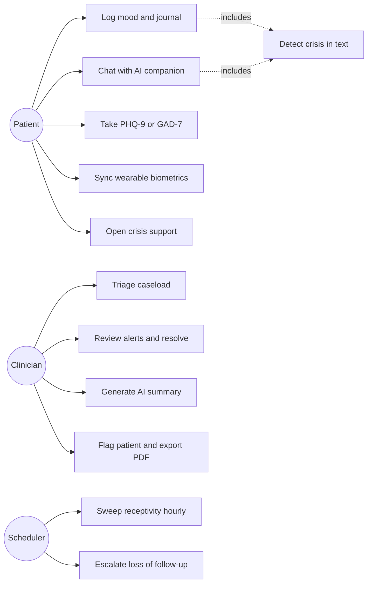

### UML 2 — Class (core backend/service abstractions)

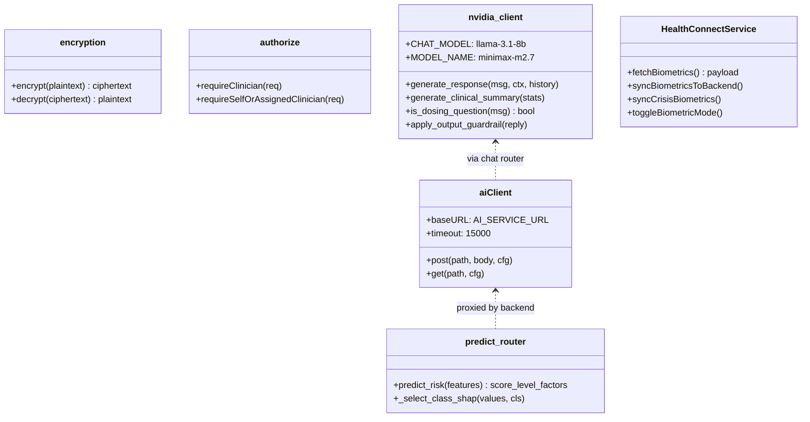

### UML 3 — Sequence (crisis chat)

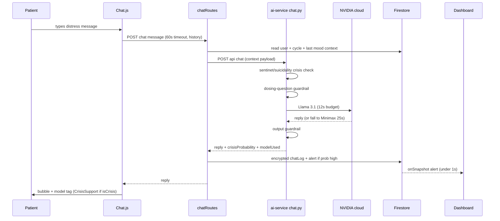

### UML 4 — Collaboration

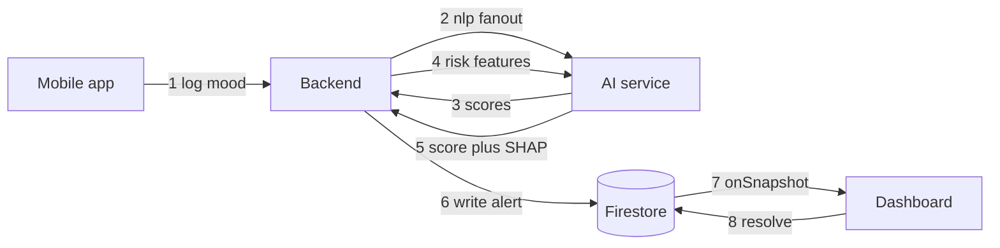

### UML 5 — Activity (biometric sync decision flow)

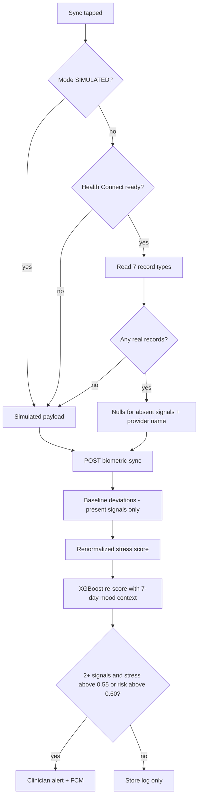

### UML 6 — State (patient risk lifecycle)

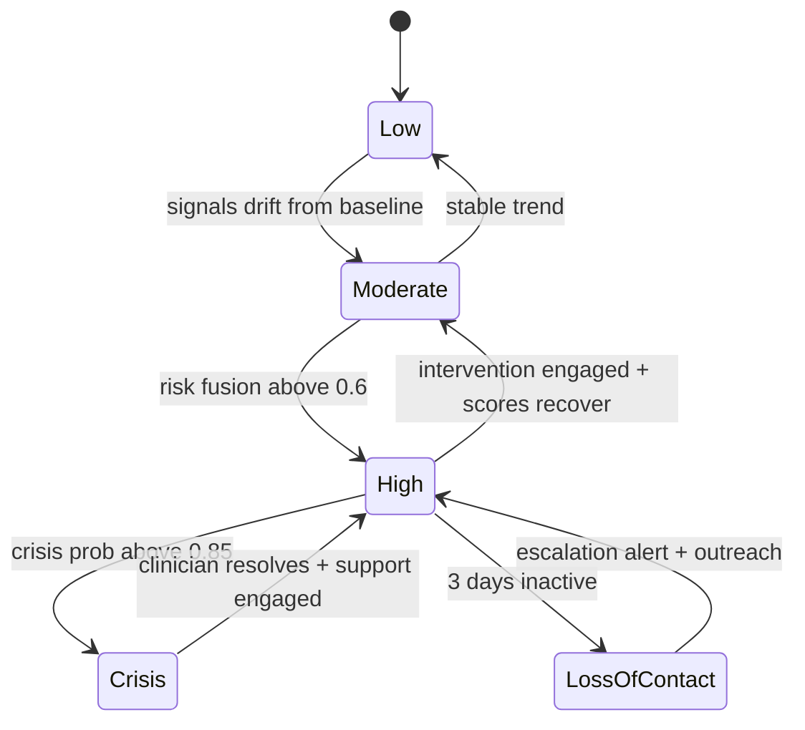

### UML 7 — Component

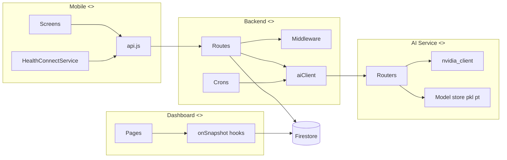

### UML 8 — Deployment (demo topology)

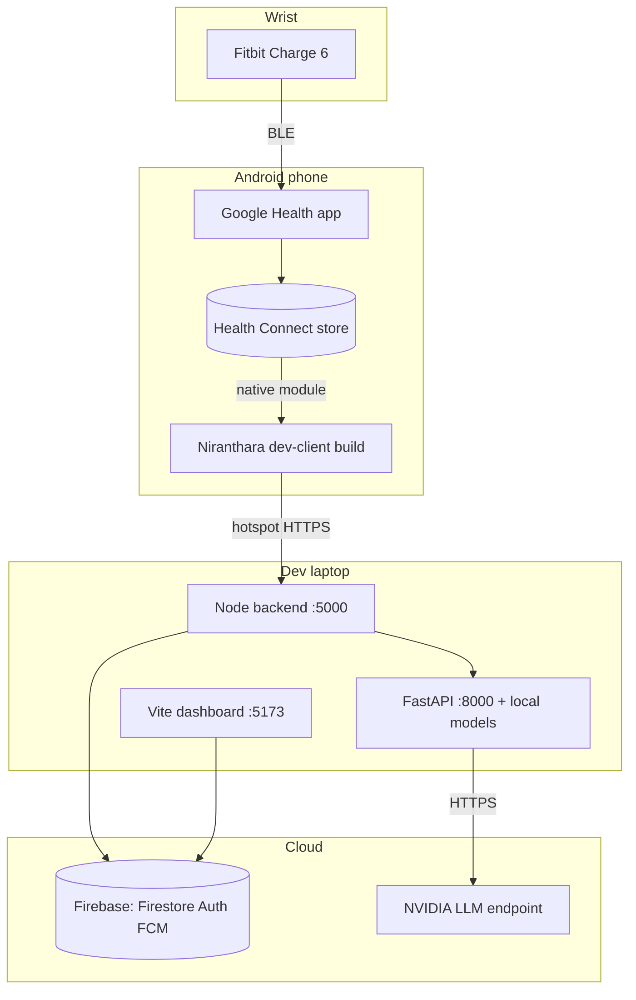

### UML 9 — Package

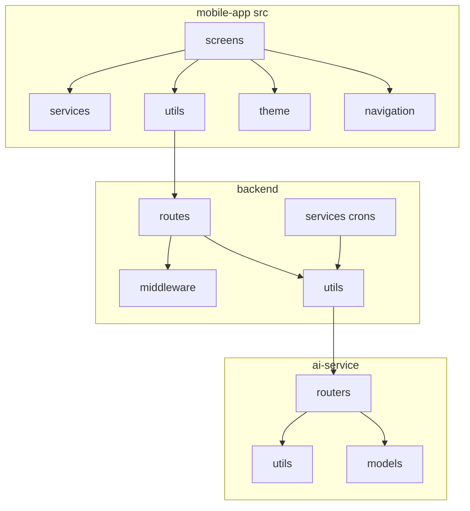

</details>

<details>
<summary>📊 Data Flow Diagrams (L0 + L1)</summary>

### DFD Level 0 — Context

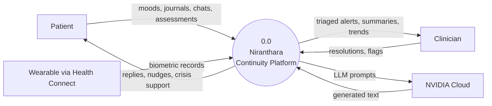

### DFD Level 1

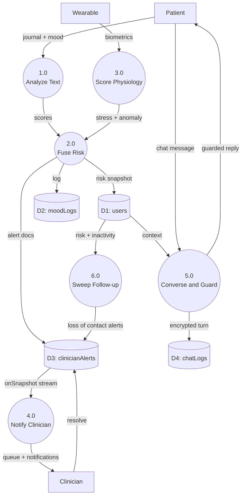

</details>

## 10. Folder Structure

```
├── ai-service/                  # Python 3.11 FastAPI — the intelligence layer (:8000)
│   ├── main.py                  # loads .env BEFORE router imports; CPU pinning; startup model warm-up
│   ├── routers/                 # 9 ML routers: chat, crisis, sentiment, emotion, predict, dropout, cycle, jitai, anomaly
│   ├── utils/
│   │   ├── nvidia_client.py     # LLM chain + two-tier guardrails + clinical summary
│   │   ├── sarvam_client.py     # Tamil STT (mockable)
│   │   └── language_detector.py # Tamil script / Tanglish / English per message
│   ├── models/                  # risk_model.pkl, dropout_model.pkl, per-user user_cycles/ user_jitai/ user_autoencoders/
│   ├── download_models.py       # one-time HF downloads + XGBoost training (needs PYTHONUTF8=1)
│   └── .venv/                   # uv-built CPython 3.11 (the committed venv/ is dead — ignore)
├── backend/                     # Node 20 Express 5 — orchestration (:5000)
│   ├── index.js                 # fail-fast config, request log, safety nets, graceful shutdown, crons
│   ├── routes/                  # auth, mood, chat, cycle, jitai, clinician, passive, biometric, risk, assessments
│   ├── middleware/              # verifyToken (Firebase), authorize (IDOR guard), rateLimiter
│   ├── services/                # jitaiScheduler (hourly), escalationCron (15 min), notificationService (FCM), baselineService
│   ├── utils/                   # aiClient (single AI boundary), encryption (AES-256-GCM), validators
│   └── scripts/seedTestUser.js  # demo patient + alerts + PHQ-9 trajectory
├── dashboard/                   # React 19 + Vite 8 clinician web (:5173)
│   └── src/
│       ├── pages/               # Dashboard (triage), PatientDetail (charts, SHAP, summary), Alerts, Login
│       ├── hooks/usePatients.js # onSnapshot caseload + alerts + browser notifications
│       └── index.css            # design system: tokens, focus states, skeletons, reduced motion
├── mobile-app/                  # React Native Expo SDK 54 patient app
│   └── src/
│       ├── screens/             # Home, Chat, Journal, Assessment, CrisisSupport, Cycle, Insights, interventions/
│       ├── services/            # HealthConnectService (wearable adapter), syncService (offline queue), passiveMonitor
│       ├── utils/api.js         # BASE_URL (set your LAN IP), 8s global timeout, chat overrides to 60s
│       └── theme/theme.js       # Build_Guide §40 tokens — single source of design truth
├── smartwatch/                  # Node biometric simulator (optional)
└── docs/                        # DEMO_RUNBOOK (master demo + 28-demo cookbook), NIRANTHARA_V2_MASTER_PLAN, HACKATHON_STRATEGY
```

## 11. Getting Started

**Prerequisites:** Node ≥18 · Python 3.10+ (or [uv](https://docs.astral.sh/uv/)) · a Firebase project (Firestore + Auth + FCM) · a free NVIDIA API key from build.nvidia.com · Android phone (physical, for Health Connect) · optional wearable.

```bash
# 1 — install
cd backend    && npm install && cd ..
cd dashboard  && npm install && cd ..
cd mobile-app && npm install && cd ..
cd ai-service
uv venv .venv --python 3.11
uv pip install -r requirements.txt --python .venv/Scripts/python.exe

# 2 — models (one-time, ~2 GB, then trains XGBoost)
PYTHONUTF8=1 .venv/Scripts/python.exe download_models.py

# 3 — secrets (see table below), then seed a demo patient
cd backend && node scripts/seedTestUser.js

# 4 — run (three terminals)
cd ai-service && PYTHONUTF8=1 .venv/Scripts/python.exe -m uvicorn main:app --port 8000
cd backend    && node index.js
cd dashboard  && npm run dev          # http://localhost:5173
cd mobile-app && npx expo start --dev-client   # dev build required for Health Connect
```

### Environment Variables

| File | Variable | Purpose |
|---|---|---|
| `backend/.env` | `PORT` | API port (5000) |
| | `AI_SERVICE_URL` | FastAPI base (default `http://localhost:8000`) |
| | `ENCRYPTION_KEY` | 32-byte hex for AES-256-GCM — **boot fails without it** |
| `backend/serviceAccountKey.json` | — | Firebase Admin credentials — **boot fails without it** |
| `ai-service/.env` | `NVIDIA_API_KEY` | LLM chain (build.nvidia.com, free tier) |
| | `NVIDIA_CHAT_MODEL` / `NVIDIA_CHAT_TIMEOUT` | chat primary (default `meta/llama-3.1-8b-instruct`, 12s) |
| | `NVIDIA_MODEL` / `NVIDIA_PRIMARY_TIMEOUT` | quality tier (default `minimaxai/minimax-m2.7`, 25s) |
| | `SARVAM_API_KEY` | optional Tamil STT (mock mode without) |
| `dashboard/.env` | `VITE_FIREBASE_*`, `VITE_API_URL` | Firebase web config + backend URL |
| `mobile-app/src/utils/firebase.js` | — | Firebase web config |
| `mobile-app/src/utils/api.js` | `BASE_URL` | **your machine's LAN IP** for physical devices (`10.0.2.2` for emulator) |

## 12. API Reference

<details>
<summary>Backend REST endpoints (all protected routes require Firebase JWT; patient-scoped routes enforce self-or-assigned-clinician)</summary>

| Method | Endpoint | Purpose |
|---|---|---|
| POST | `/api/auth/register` | Create user profile document |
| POST | `/api/mood/log` | The heavy path: encrypt → NLP fan-out → risk fusion → alert |
| GET | `/api/mood/weekly/:uid` · `/monthly/:uid` · `/history/:uid` | Trend reads (journal ciphertext stripped) |
| POST | `/api/assessments` | PHQ-9/GAD-7 server-side scoring; item-9 → clinician alert |
| GET | `/api/assessments/:uid?type=` | Assessment history |
| POST | `/api/chat/message` | Context-enriched guarded chat (LLM chain) |
| GET | `/api/chat/thread/:uid` | Self-only decrypted thread restore (memory across restarts) |
| POST | `/api/chat/voice` | Sarvam STT → chat |
| POST | `/api/passive/biometric-sync` | Wearable ingestion → stress score → XGBoost re-score |
| GET | `/api/passive/summary/:uid` · `/biometrics/:uid` | Home stats / latest snapshot |
| POST | `/api/cycle/log-period` · GET `/today/:uid` · `/predict/:uid` | Cycle logging + LSTM forecast |
| POST | `/api/jitai/check` | On-demand receptivity |
| GET | `/api/clinician/patients` · `/patient/:uid` | Triage list / full detail (clinician role) |
| GET | `/api/clinician/summary/:uid` | AI clinical summary (structured aggregates only) |
| GET | `/api/clinician/alerts` · PUT `/resolve-alert/:id` · POST `/flag/:uid` | Alert workflow |
| POST | `/api/risk/predict` · `/explain` | Direct risk scoring + SHAP explanation |

AI-service endpoints (`:8000/api/*` — internal; called only via `backend/utils/aiClient.js` in production topology): `/chat`, `/chat/summary`, `/chat/transcribe`, `/crisis/detect`, `/sentiment/analyze`, `/emotion/detect`, `/predict/risk`, `/predict/explain`, `/dropout/predict`, `/cycle/train/:uid`, `/cycle/predict/:uid`, `/jitai/receptivity`, `/jitai/train`, `/jitai/log-response`, `/anomaly/score`, `/anomaly/train`, `/anomaly/status/:uid`. Interactive docs at `http://localhost:8000/docs`.

</details>

## 13. Database Schema (Firestore)

| Collection | Key fields | Written by | Read by |
|---|---|---|---|
| `users` | role, assignedClinician, riskLevel/riskScore, **topFactors**, last_phq9/last_gad7, baselineData, lastBiometricSync, cycle fields | backend | dashboard (onSnapshot), backend |
| `moodLogs` | uid, moodScore, **journalText (AES-256-GCM)**, nlpResults, moodSentimentDivergence, cycleVulnerability, riskScore, topFactors | moodRoutes | dashboard, clinician summary |
| `assessments` | uid, type (phq9/gad7), answers[], score, severity, **selfHarmFlag** | assessmentRoutes | dashboard trajectory |
| `chatLogs` | uid, **userMessage (encrypted)**, aiReply, crisisProbability, modelUsed | chatRoutes | `/chat/thread` (self-only decrypt) |
| `clinicianAlerts` | patientUid, **clinicianUid (required — dashboard filters on it)**, type, severity, triggerFactors, resolved | moodRoutes, biometricRoutes, assessmentRoutes, escalationCron, chat crisis | dashboard (onSnapshot), `/clinician/alerts` |
| `biometricLogs` | per-signal values + deviations (nulls preserved), **signalCount**, physiologicalStressScore | biometricRoutes | dashboard biometrics |
| `jitaiLogs` | intervention, receptivityScore, engaged | jitaiScheduler | per-user model retraining |
| `passiveLogs` / `cycleLogs` | passive daily stats / period history | passiveRoutes, cycleRoutes | features, Home |

**Deliberate demo-scale tradeoff:** several readers fetch-by-uid and filter/sort in memory to avoid Firestore composite-index setup; production restores indexed queries (documented in `docs/NIRANTHARA_V2_MASTER_PLAN.md` §10 with the PostgreSQL + TimescaleDB migration).

## 14. Security Model

| Layer | Implementation |
|---|---|
| Authentication | Firebase Auth; every protected route runs `verifyIdToken` (`middleware/verifyToken.js`); mobile attaches the JWT via axios interceptor |
| Authorization | `middleware/authorize.js` — self-or-assigned-clinician on all patient data (IDOR closed across 9 route files); raw chat is **self-only**, not even the assigned clinician |
| Encryption | AES-256-GCM per field (journals, chat, notes) before Firestore; unique IV + auth tag; ciphertext stripped from history responses |
| LLM safety | Two deterministic guardrail tiers (input dosing-question deferral, output dosing block) + hardened system prompt (no diagnosis, no methods, no doctor claims); crisis classifier gates every message |
| Privacy boundaries | Dashboard renders model-derived scores, never raw text; clinical summary consumes structured aggregates only; request logs carry no bodies/PII |
| Rate limiting | Per-class limiters on chat, NLP, and general routes |
| Config safety | Fail-fast boot on missing `ENCRYPTION_KEY`/service key; secrets gitignored with `.env.example` templates |

## 15. Performance & Robustness

- **Measured demo latencies:** mood log → dashboard alert **1.2s**; warm chat **~2–8s** end-to-end (LLM ~1–2s + CPU crisis classifier); guardrail deferral **0.2s**; thread restore **49ms**; AI summary 5–30s.
- **Latency-first LLM chain** with bounded tiers (12s + 25s) that always fit inside the backend's 45s and mobile chat's 60s ceilings; `max_retries=0` so timeouts never multiply.
- **Startup warm-up** of the crisis classifier eliminates the ~40s first-message penalty.
- **Degradation ladder everywhere:** NLP fan-out is `allSettled`; risk falls back to labeled defaults; summary falls back to a deterministic template; chat falls to rotating static lines; biometrics fall to simulation with a stated reason. Logging a mood never blocks on any model.
- **Partial-sensor rules:** absent wearable signals are excluded (never zeroed), stress weights renormalize, and stress alerts need ≥2 corroborating signals.
- Verified by **30 automated end-to-end checks** (10-beat demo rehearsal + 20 extended endpoint/authz tests) run against live services.

## 16. Scalability Design

Demo-scale today (single host, ~1K-user pilot capacity), with the seams already cut for growth — the full staged plan (1K → 100K → 1M → 10M) lives in [`docs/NIRANTHARA_V2_MASTER_PLAN.md`](docs/NIRANTHARA_V2_MASTER_PLAN.md) §15:

1. **100K:** Firestore composite indexes → PostgreSQL + TimescaleDB; BullMQ queue behind `aiClient` for biometric ingestion; service replicas.
2. **1M:** GPU inference with batching; per-user model files → feature-conditioned shared models; feature store.
3. **10M:** multi-region, org data residency, federated learning across deployments.

## 17. Testing & Verification

There is no unit-test suite (hackathon scope — honest). Verification is **live end-to-end**: `scripts` in the session scratchpad drive the full demo as an authenticated patient and clinician (30 checks: every route, every model, authz negatives, partial-data edge cases), plus the human checklist in [`docs/DEMO_RUNBOOK.md`](docs/DEMO_RUNBOOK.md) — startup order, smoke tests, the 28-demo cookbook (§3.5), THE MASTER DEMO script (§3), and a failure playbook (§4). Production path: pytest for routers, supertest for routes, Detox for mobile (roadmap V1).

## 18. Engineering Decisions & Tradeoffs

| Decision | Why | Tradeoff accepted |
|---|---|---|
| Health Connect hub instead of Fitbit API | One adapter covers every Android wearable; vendor-blind ML features | Fitbit's HRV never reaches Health Connect (handled by partial-data rules); iOS needs HealthKit (V2) |
| Firestore as integration bus | `onSnapshot` gives <1s dashboard reactivity with zero infra | Analytical queries need client-side filtering until the Postgres migration |
| Latency-first LLM chain (Llama primary) | Conversation needs seconds; reasoning models measured at 20–60s | Chat quality slightly below Minimax; summary keeps Minimax first |
| Deterministic guardrails alongside ML | Safety floors must not be probabilistic | Labeled rule-based branches in an otherwise ML-first codebase |
| In-process cron instead of a queue | Demo-simple, one deployable | Horizontal scaling requires extracting to a worker (seam exists at `aiClient`) |
| Synthetic training labels, said out loud | No clinical dataset yet; self-labeling loops (JITAI, dropout, assessments) generate real labels in production | Cannot claim clinical validation — and doesn't |

## 19. Roadmap

**V1 (pilot-safe):** consent + audit collections, alert acknowledgment SLA, composite indexes, test suite, Fitbit Web API adapter (full HRV). **V2 (org-deployable):** PostgreSQL/Timescale, HealthKit + Garmin, mood forecasting, FHIR interface, MLflow registry, multi-tenancy. **V3+:** teleconsult, voice biomarkers, research platform, federated learning. Full tiers with rationale: [`docs/NIRANTHARA_V2_MASTER_PLAN.md`](docs/NIRANTHARA_V2_MASTER_PLAN.md).

## 20. Troubleshooting

| Symptom | Cause → Fix |
|---|---|
| Chat always returns the same message | Check `modelUsed`: `fallback_*` → `NVIDIA_API_KEY` missing/invalid in `ai-service/.env`; untagged after 8s → a client somewhere isn't using the 60s chat timeout |
| Port 8000/5000 already in use | Zombie child processes — `Get-Process python \| Stop-Process -Force` (PowerShell) |
| Biometric card says SIMULATED | Read `fallbackReason`: `permission_denied` → Health Connect app permissions; `no_records` → open Google Health app (formerly Fitbit) and let it sync first; Expo Go → use the dev-client build |
| Phone can't reach backend | Same hotspot + `BASE_URL` = laptop IPv4 + allow Node through Windows Firewall; verify `http://<ip>:5000/api/health` from the phone browser |
| `download_models.py` crashes with UnicodeEncodeError | `PYTHONUTF8=1` |
| Firestore "query requires an index" | Click the console URL printed in backend logs once per project |
| Backend exits at boot | Read the FATAL line — `ENCRYPTION_KEY` or `serviceAccountKey.json` missing (by design) |

## 21. Documentation

| Doc | Contents |
|---|---|
| [`docs/DEMO_RUNBOOK.md`](docs/DEMO_RUNBOOK.md) | Setup, THE MASTER DEMO (8 min, 5 acts), 28-demo cookbook, failure playbook |
| [`docs/NIRANTHARA_V2_MASTER_PLAN.md`](docs/NIRANTHARA_V2_MASTER_PLAN.md) | 111-feature roadmap, target architecture, DB migration, scaling, GTM |
| [`docs/HACKATHON_STRATEGY.md`](docs/HACKATHON_STRATEGY.md) | Problem-statement decode, presentation plans, 50 judge Q&As |
| [`CLAUDE.md`](CLAUDE.md) | Live engineering conventions and verified gotchas |

## 22. Credits

Built by **Team Niranthara — Anna University Regional Campus, Tirunelveli**, for an AI-in-mental-healthcare hackathon. Models: MentalRoBERTa (mental), IndicBERT (AI4Bharat), emotion-distilroberta (J. Hartmann), Llama 3.1 (Meta) and Minimax M2.7 via NVIDIA's cloud endpoint. Crisis resources surfaced in-app: **Tele-MANAS 14416 · iCall 9152987821 · NIMHANS 080-46110007**.

> Niranthara is a clinical decision-support and continuity tool. It augments clinicians — it never diagnoses, prescribes, or replaces professional care.

